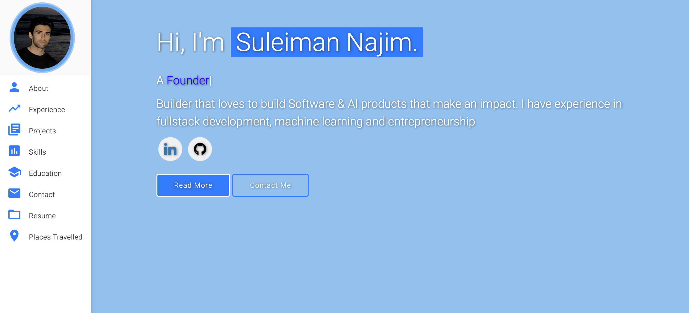
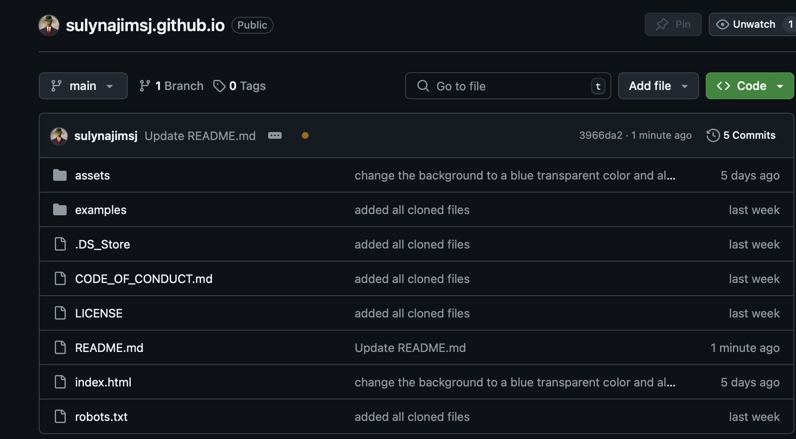
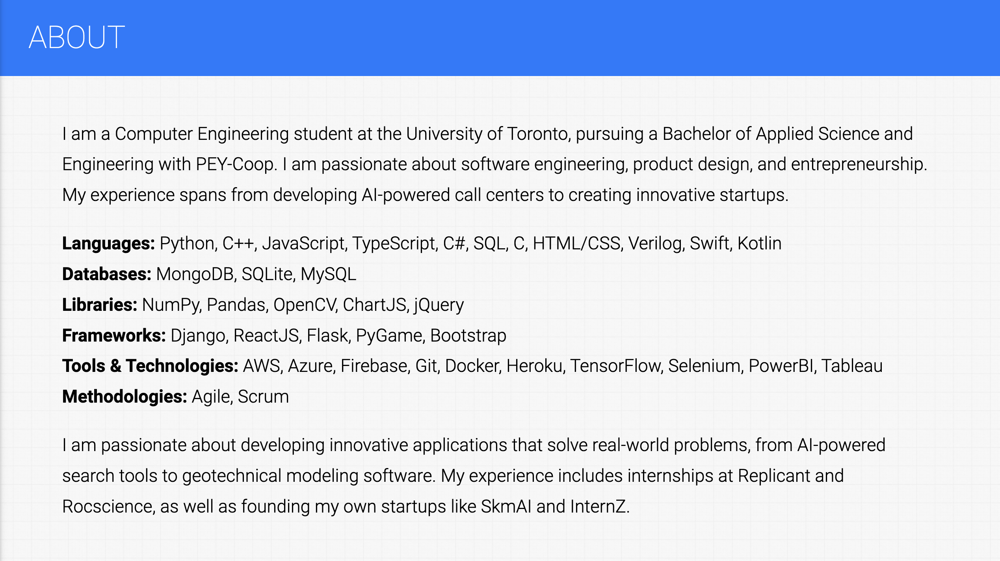
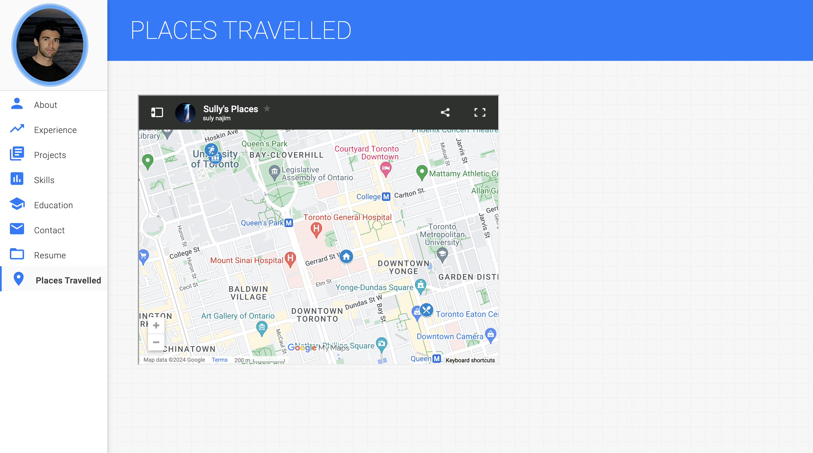
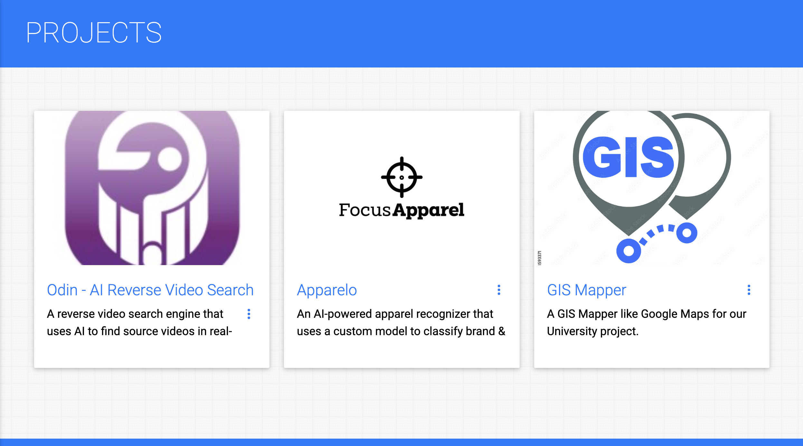

# Suleiman Najim's Personal Website

This repository contains the code for my personal website, hosted on [GitHub Pages](http://sulynajimsj.github.io/).

You can visit the live website here: [http://sulynajimsj.github.io/](http://sulynajimsj.github.io/)

## 🌟 About

This website serves as a portfolio and personal showcase. It's built using:

- HTML
- CSS
- JavaScript

Providing an interactive and responsive design to effectively display my work and skills.

## 🙏 Acknowledgements

This repository is a clone of [varadbhogayata's personal website](https://github.com/varadbhogayata/personal-website)

https://github.com/varadbhogayata/personal-website

# Repository Screenshot

### Deployed Website Screenshot

### Repository Screenshot

---

# Personal Information

### Deployed Website Screenshot

---

# Theme color change

### Deployed Website Screenshot

---

# Places travelled

### Deployed Website Screenshot

---

# Top Three Projects

### Deployed Website Screenshot

---

